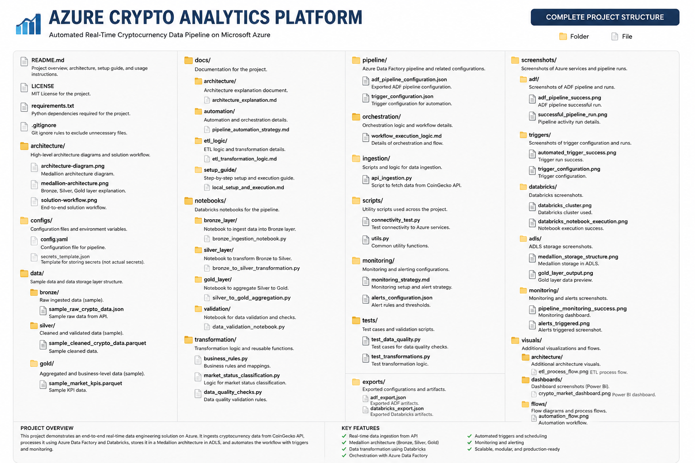
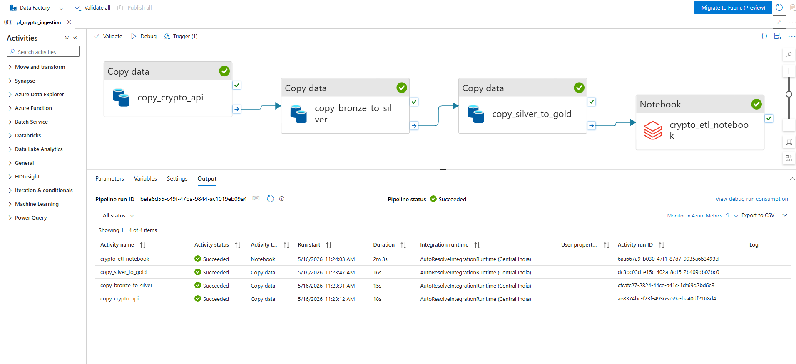
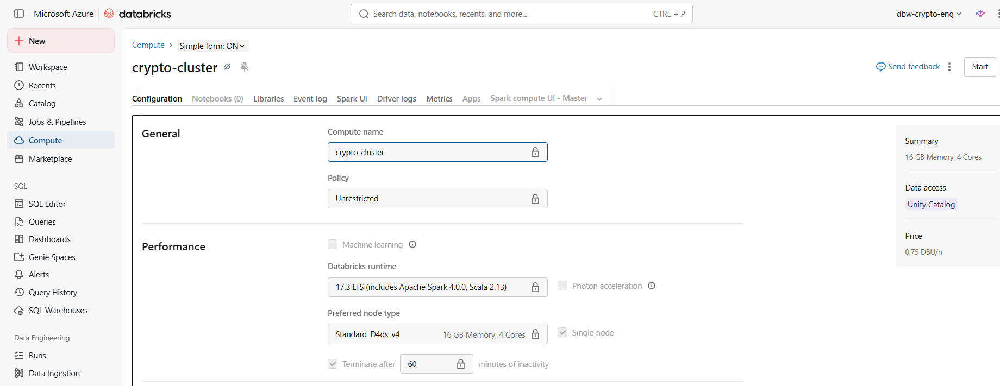
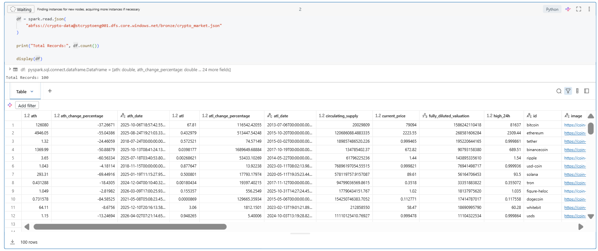
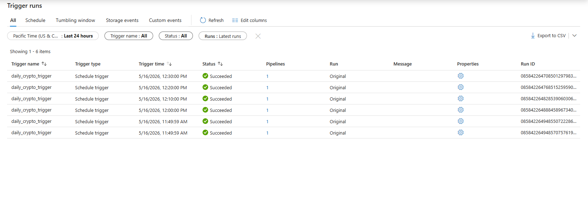
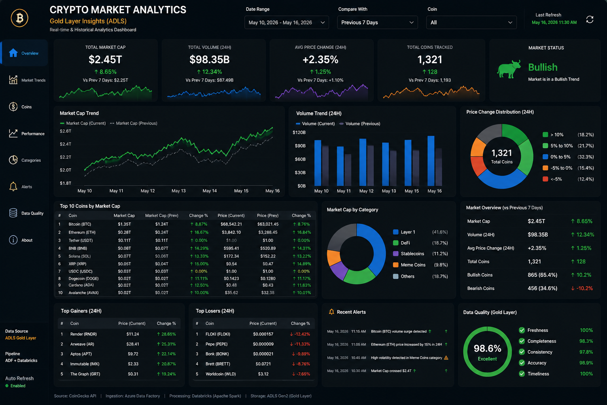

# Azure Crypto Analytics Lakehouse



## Enterprise-Grade Cloud Data Engineering Platform for Cryptocurrency Market Analytics

An enterprise-style end-to-end Azure Data Engineering platform designed to automate cryptocurrency market data ingestion, orchestration, transformation, monitoring, and analytical processing using Microsoft Azure cloud-native services.

The platform follows a Medallion Architecture approach using Bronze, Silver, and Gold layers to support scalable, automated, and production-oriented ETL workflows.

---

# Table of Contents

* [Project Overview](#project-overview)
* [Business Objective](#business-objective)
* [Solution Architecture](#solution-architecture)
* [Technology Stack](#technology-stack)
* [Medallion Architecture](#medallion-architecture)
* [Pipeline Workflow](#pipeline-workflow)
* [Automation Strategy](#automation-strategy)
* [Project Structure](#project-structure)
* [Azure Data Factory Pipeline](#azure-data-factory-pipeline)
* [Azure Databricks Transformations](#azure-databricks-transformations)
* [Monitoring & Observability](#monitoring--observability)
* [Gold Layer Business KPIs](#gold-layer-business-kpis)
* [Sample Outputs](#sample-outputs)
* [Setup & Execution](#setup--execution)
* [Future Improvements](#future-improvements)
* [Screenshots](#screenshots)
* [Author](#author)

---

# Project Overview

The Azure Crypto Analytics Platform is a cloud-native ETL and analytics solution built using Microsoft Azure services.

The project automates:

* Cryptocurrency API ingestion
* Cloud orchestration
* Data lake storage
* Distributed transformation processing
* Automated scheduling
* Business KPI generation
* Monitoring workflows

The solution demonstrates enterprise-style data engineering concepts including:

* Azure Data Factory orchestration
* Azure Databricks notebook execution
* Medallion Architecture implementation
* Automated pipeline scheduling
* Cloud-based analytical processing
* Production-style monitoring

---

# Business Objective

The primary objective of this platform is to simulate a production-grade cryptocurrency analytics ecosystem capable of:

* Continuously ingesting crypto market data
* Processing historical and latest market datasets
* Classifying market movement behavior
* Generating analytical KPIs
* Supporting scalable cloud-based analytics

The project is designed as a portfolio-grade enterprise data engineering solution.

---

# Solution Architecture

## High-Level Architecture


The architecture consists of:

1. CoinGecko REST API
2. Azure Data Factory orchestration
3. Azure Data Lake Storage Gen2
4. Azure Databricks transformation engine
5. Gold-layer analytical outputs
6. Monitoring and automation workflows

---

# Technology Stack

| Category              | Technologies                 |
| --------------------- | ---------------------------- |
| Cloud Platform        | Microsoft Azure              |
| Orchestration         | Azure Data Factory           |
| Storage               | Azure Data Lake Storage Gen2 |
| Processing            | Azure Databricks             |
| Transformation Engine | PySpark                      |
| Programming Language  | Python                       |
| Data Format           | JSON, Parquet                |
| Automation            | ADF Schedule Triggers        |
| Version Control       | Git & GitHub                 |
| Visualization         | Power BI (Planned)           |

---

# Medallion Architecture

The project follows a layered Medallion Architecture pattern.

## Bronze Layer

Purpose:

* Store raw cryptocurrency API data
* Preserve original source payloads
* Maintain ingestion history

Characteristics:

* Raw JSON ingestion
* Immutable landing zone
* Historical data accumulation

---

## Silver Layer

Purpose:

* Clean and standardize datasets
* Prepare analytical-ready schemas

Transformations:

* Null handling
* Schema standardization
* Data type corrections
* Derived business columns

---

## Gold Layer

Purpose:

* Generate business-facing KPIs
* Support analytical reporting
* Produce dashboard-ready outputs

Generated Metrics:

* Market status classification
* Average price movement
* Bullish vs bearish analysis
* Aggregated crypto market KPIs

---

# Pipeline Workflow

The orchestration pipeline executes the following workflow:

1. API ingestion from CoinGecko
2. Bronze layer storage
3. Silver layer transformation
4. Gold layer aggregation
5. Databricks notebook execution
6. Automated monitoring

---

# Automation Strategy

The project uses Azure Data Factory schedule triggers to automate execution.

## Current Trigger Configuration

| Setting        | Value                      |
| -------------- | -------------------------- |
| Trigger Type   | Schedule Trigger           |
| Frequency      | Every 6 Hours              |
| Execution Mode | Automated                  |
| Monitoring     | Azure Data Factory Monitor |

Automation Benefits:

* Continuous market ingestion
* Reduced manual operations
* Historical dataset accumulation
* Production-style orchestration

---

# Project Structure

```bash
azure-crypto-analytics-platform/
│
├── configs/
├── docs/
├── exports/
├── monitoring/
├── notebooks/
├── pipeline/
├── screenshots/
├── visuals/
│
├── README.md
├── requirements.txt
├── LICENSE
└── .gitignore
```

---

# Azure Data Factory Pipeline

The orchestration workflow is implemented using Azure Data Factory.

## Pipeline Activities

| Activity              | Purpose                             |
| --------------------- | ----------------------------------- |
| copy_crypto_api       | API ingestion                       |
| copy_bronze_to_silver | Bronze to Silver transition         |
| copy_silver_to_gold   | Silver to Gold transition           |
| crypto_etl_notebook   | Databricks transformation execution |

## Pipeline Screenshots

### Successful Pipeline Execution




---

# Azure Databricks Transformations

Azure Databricks performs distributed analytical processing using PySpark.

## Transformation Responsibilities

* Data cleansing
* Schema normalization
* KPI aggregation
* Market classification
* Analytical output generation

## Databricks Cluster



## Notebook Execution



---

# Monitoring & Observability

The platform includes operational monitoring using Azure-native monitoring capabilities.

## Monitoring Features

* Pipeline execution monitoring
* Trigger execution tracking
* Notebook execution monitoring
* Activity status validation

## Monitoring Dashboard


## Trigger Monitoring



---

# Gold Layer Business KPIs

The Gold layer generates business-ready analytical outputs.

## Generated Metrics

| KPI            | Description                    |
| -------------- | ------------------------------ |
| market_status  | Bullish/Bearish classification |
| total_coins    | Total coins per category       |
| avg_change_pct | Average market movement        |
| avg_price      | Average cryptocurrency pricing |

## Dashboard Preview



---

# Sample Outputs

The project stores analytical outputs in Parquet format.

## Output Format

* Parquet
* Analytics-ready datasets
* Distributed processing compatible
* Enterprise-grade storage format

## Export Samples

```bash
exports/
├── crypto_market_kpis.parquet
├── market_status_summary.parquet
└── gold_layer_sample_output.parquet
```

---

# Setup & Execution

## Prerequisites

Required Azure Services:

* Azure Data Factory
* Azure Data Lake Storage Gen2
* Azure Databricks
* Azure Subscription

---

## Local Setup

Clone repository:

```bash
git clone https://github.com/mumairnawaz/azure-crypto-analytics-platform.git
```

Install dependencies:

```bash
pip install -r requirements.txt
```

---

## Pipeline Execution

Workflow:

1. Configure Azure resources
2. Upload notebooks
3. Configure linked services
4. Trigger pipeline execution
5. Monitor execution status

---

# Future Improvements

Potential future enhancements include:

* Delta Lake implementation
* Incremental loading
* CI/CD deployment pipelines
* Azure Monitor integration
* Power BI integration
* Retry & alerting mechanisms
* Event-driven orchestration
* Real-time streaming support

---

# Screenshots

## Azure Data Factory

| Component          | Preview                                          |
| ------------------ | ------------------------------------------------ |
| Pipeline Execution | screenshots/adf/adf_pipeline_success.png         |
| Pipeline Design    | screenshots/adf/adf_pipeline_design.png          |
| Notebook Activity  | screenshots/adf/databricks_notebook_activity.png |

---

## Databricks

| Component             | Preview                                                     |
| --------------------- | ----------------------------------------------------------- |
| Cluster Configuration | screenshots/databricks/databricks_cluster.png               |
| Notebook Execution    | screenshots/databricks/databricks_notebook_execution.png    |
| Gold Transformation   | screenshots/databricks/gold_layer_transformation_output.png |

---

## ADLS Storage

| Component         | Preview                                          |
| ----------------- | ------------------------------------------------ |
| Medallion Storage | screenshots/adls/medallion_storage_structure.png |
| Gold Layer Output | screenshots/adls/gold_layer_output.png           |
| Bronze Raw Data   | screenshots/adls/bronze_raw_data.png             |

---

# Author

## Umair Nawaz

Data Analyst | Data Engineering Enthusiast | Azure & Analytics Practitioner

### Technical Skills

* SQL
* Power BI
* Python
* Azure Data Factory
* Azure Databricks
* Azure Data Lake
* PySpark
* Data Modeling
* ETL Development
* Data Visualization

---

# Repository Objective

This repository demonstrates:

* Enterprise cloud data engineering practices
* End-to-end ETL orchestration
* Distributed transformation workflows
* Azure-native analytics architecture
* Automated cloud pipeline execution
* Production-style monitoring and processing
